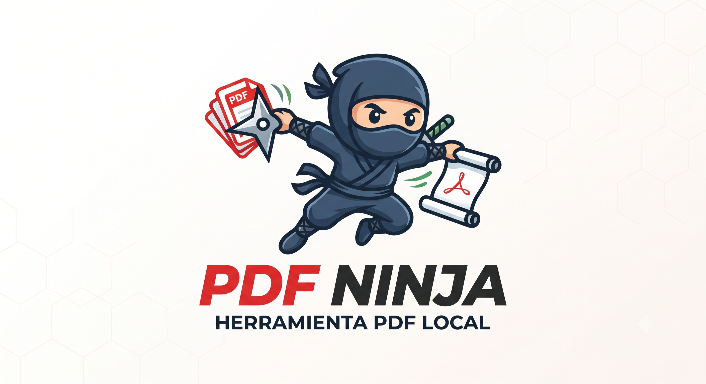

<p align="center">
  
</p>

<h1 align="center">PDF Ninja</h1>

<p align="center">
  <strong>Suite de herramientas PDF profesional, completa y 100% local.</strong><br>
  Convierte, organiza, protege y edita PDFs sin subir nada a la nube.
</p>

<p align="center">
  <a href="#caracteristicas">Caracteristicas</a> &middot;
  <a href="#instalacion">Instalacion</a> &middot;
  <a href="#compilar-el-exe">Compilar el .exe</a> &middot;
  <a href="#tecnologias">Tecnologias</a> &middot;
  <a href="#licencia">Licencia</a>
</p>

---

## Caracteristicas

### Conversiones
- **PDF a Word** (.docx editable)
- **PDF a Excel** (.xlsx, extrae tablas)
- **PDF a Imagen** (PNG/JPG por pagina, descarga en .zip)
- **Imagen a PDF** (combina varias imagenes en un PDF)
- **PDF a Texto** plano (.txt)
- **PDF a PDF/A** (mejor portabilidad)

### Organizar
- **Fusionar** varios PDFs en uno
- **Dividir** por paginas o rangos (`1-3,5;7-9` para varios grupos)
- **Organizar** (reordenar/eliminar paginas)
- **Rotar** 90&deg;/180&deg;/270&deg; (todas o paginas especificas)
- **Comprimir** (3 niveles de calidad)

### Edicion
- **Marca de agua** (texto, posicion, color, tamano, rotacion arbitraria)
- **Numeros de pagina** automaticos

### Seguridad
- **Proteger** con contrasena (AES-256)
- **Desproteger** PDF cifrado

## Por que PDF Ninja

- **Privacidad total** — todo se procesa en tu computador. No hay servidor remoto, no se envian archivos a internet.
- **Sin cuenta, sin suscripcion, sin telemetría** — instalas y usas.
- **Portable** — puedes llevarla en un USB y abrir PDFs en cualquier PC.
- **Auditable** — el codigo es 100% abierto y puedes verificar que no hace nada raro.
- **Multiples modos de uso** — `.exe` portable, ventana nativa o navegador web, tu eliges.

## Modos de ejecucion

PDF Ninja se puede usar de **tres formas**, segun tus necesidades:

### 1. Programa portable — recomendado para usuarios finales

No necesita Python instalado. Descarga, descomprime, doble clic.

- **Windows**: descarga el `.zip` desde [Releases](https://github.com/jaguayoara/pdf-ninja/releases), descomprime y abre `PdfNinja.exe`. Doble clic y listo.
- **macOS / Linux**: compilar desde codigo fuente con `build.sh` (ver [Compilar el binario portable](#compilar-el-binario-portable)).

**Requisitos del sistema final:**
- Windows 10/11 con **WebView2 Runtime** (ya viene preinstalado en Windows 10 22H2+ y Windows 11)
- macOS 11+ con WebKit (nativo)
- Linux con `webkit2gtk-4.0` o `webkit2gtk-4.1` (ver seccion Linux)

**Tamano aproximado del paquete:** ~270 MB (onedir, sin optimizacion adicional).

### 2. Modo escritorio (ventana nativa) — desarrollo

Misma experiencia que el binario portable pero sin empaquetar. Requiere Python 3.10+.

```bash
pip install -r requirements.txt
python desktop.py
```

Se abre una **ventana nativa maximizada** usando el webview del sistema (Edge WebView2 en Windows, WKWebView en macOS, WebKitGTK en Linux). Flask corre internamente en un thread en background.

### 3. Modo navegador (web clasica)

Para entornos donde la ventana nativa no es ideal (servidores, WSL, SSH, etc.).

```bash
pip install -r requirements.txt
python app.py
```

Y abre `http://127.0.0.1:5050` en tu navegador.

### Script de inicio automatico

- Windows: doble clic en `start.bat`
- macOS / Linux: `bash start.sh` (o `chmod +x start.sh && ./start.sh`)

El script detecta automaticamente el modo:
- Si `pywebview` esta instalado y el sistema lo soporta → abre ventana nativa.
- Si no → abre en el navegador.

## Instalacion por plataforma

### Windows (10/11)

**Opcion 1: doble clic**
1. Descarga o clona el proyecto.
2. Haz **doble clic** en `start.bat`.
3. La primera vez instalara las dependencias y luego abrira la app.

**Opcion 2: PowerShell**
```powershell
git clone https://github.com/jaguayoara/pdf-ninja.git
cd pdf-ninja
python -m pip install -r requirements.txt
python app.py
```

Luego abre `http://127.0.0.1:5050` en tu navegador.

**Nota:** requiere **Python 3.10+** desde [python.org](https://www.python.org/downloads/windows/) o Microsoft Store. Marcá "Add Python to PATH" al instalar.

### macOS (11 Big Sur o superior)

**Opcion 1: Homebrew (recomendado)**
```bash
brew install python3 git
git clone https://github.com/jaguayoara/pdf-ninja.git
cd pdf-ninja
python3 -m pip install -r requirements.txt
python3 app.py
```

**Opcion 2: instalador oficial**
1. Instala Python 3.10+ desde [python.org/downloads/macos](https://www.python.org/downloads/macos/).
2. `git clone https://github.com/jaguayoara/pdf-ninja.git && cd pdf-ninja`
3. `python3 -m pip install -r requirements.txt`
4. `python3 app.py` (o `bash start.sh` para auto-detectar modo nativo)

**Para ventana nativa (`desktop.py`):** pywebview usa WKWebView que viene con macOS, no necesitas instalar nada extra.

**Compatibilidad:** Apple Silicon (M1/M2/M3) y Intel. Si tienes errores con `python3`, proba `python3.11` o `python3.12` explicitamente.

### Linux (Ubuntu / Debian / Fedora / Arch)

**Ubuntu / Debian:**
```bash
sudo apt update
sudo apt install -y python3 python3-pip python3-venv git libwebkit2gtk-4.1-0
git clone https://github.com/jaguayoara/pdf-ninja.git
cd pdf-ninja
python3 -m pip install -r requirements.txt
python3 app.py
```

**Fedora:**
```bash
sudo dnf install -y python3 python3-pip git webkit2gtk4.1
git clone https://github.com/jaguayoara/pdf-ninja.git
cd pdf-ninja
python3 -m pip install -r requirements.txt
python3 app.py
```

**Arch / Manjaro:**
```bash
sudo pacman -S python python-pip git webkit2gtk-4.1
git clone https://github.com/jaguayoara/pdf-ninja.git
cd pdf-ninja
python3 -m pip install -r requirements.txt
python3 app.py
```

**Para ventana nativa (`desktop.py`):** ademas de las dependencias de arriba, necesitás los bindings de GObject para que pywebview use WebKitGTK:
- Debian/Ubuntu: `sudo apt install -y python3-gi gir1.2-webkit2-4.1`
- Fedora: `sudo dnf install -y python3-gobject`
- Arch: `sudo pacman -S python-gobject`

**Sin ventana nativa:** si no podes instalar las libs de GTK, simplemente corré `python3 app.py` y usa el navegador. Todo funciona igual.

**Snap / Flatpak:** tambien podes correrla en modo navegador dentro de un container sin permisos especiales, ya que todo el procesamiento es local.

## Compilar el binario portable

> **Importante:** los binarios son **especificos por plataforma**. Hay que compilar el `.exe` en Windows, el `.app` en macOS, y el binario en Linux desde cada sistema. No se pueden cruzar binarios entre sistemas (los modulos como PyMuPDF y pikepdf traen librerias nativas compiladas para cada OS).

### Windows

```powershell
build.bat
```

Equivale a:
```powershell
python -m pip install pyinstaller==6.10.0
python -m PyInstaller --noconfirm --clean PdfNinja.spec
```

Resultado en `dist\PdfNinja\PdfNinja.exe`. Comprimi esa carpeta en un `.zip` para distribuir.

### macOS / Linux

```bash
bash build.sh
# o: chmod +x build.sh && ./build.sh
```

Equivale a:
```bash
python3 -m pip install pyinstaller==6.10.0
python3 -m PyInstaller --noconfirm --clean PdfNinja.spec
```

Resultado en `dist/PdfNinja/PdfNinja` (lanzador) + `dist/PdfNinja/_internal/` (librerias + assets). Comprimi esa carpeta en un `.tar.gz` o `.zip` para distribuir.

**En macOS** podes opcionalmente envolver el binario en un `.app` con `py2app` o similar, pero el binario suelto funciona bien.

### GitHub Actions (solo Windows por ahora)

El repo incluye un workflow en `.github/workflows/build-windows.yml` que compila el `.exe` automaticamente cuando creas un tag. Ver [Releases](https://github.com/jaguayoara/pdf-ninja/releases) para los binarios pre-construidos.

> **Por que `onedir` y no `onefile`:** PyMuPDF, pikepdf y pdf2docx traen binarios nativos pesados. En modo `onefile`, cada arranque descomprime ~200 MB a una carpeta temporal, tardando 5-10 segundos. Con `onedir`, el binario es ligero y arranca instantaneo.

## Uso

1. **Inicio:** veras una pagina con todas las herramientas agrupadas por categoria.
2. **Buscar:** usa el buscador para filtrar herramientas rapido.
3. **Elegir una herramienta:** arrastra tu PDF al area de drop o haz clic para seleccionarlo.
4. **Ajustar opciones** (si las hay) en el panel lateral.
5. **Procesar** y el archivo se descargara automaticamente.

## Estructura del proyecto

```
PDF Ninja/
├── app.py                  # Servidor Flask principal
├── desktop.py              # Lanzador ventana nativa (pywebview)
├── requirements.txt        # Dependencias Python
├── start.bat               # Launcher auto en Windows
├── start.sh                # Launcher auto en macOS / Linux
├── PdfNinja.bat            # Atajo al .exe ya compilado (Windows)
├── build.bat               # Empaqueta el .exe con PyInstaller (Windows)
├── build.sh                # Empaqueta el binario con PyInstaller (macOS/Linux)
├── PdfNinja.spec           # Configuracion de PyInstaller
├── LICENSE                 # Licencia MIT
├── core/
│   ├── __init__.py
│   ├── utils.py            # Helpers, validacion, parseo de rangos
│   ├── converter.py        # PDF <-> Word/Excel/Imagen/Texto
│   ├── manipulator.py      # Fusionar/dividir/rotar/comprimir/etc.
│   ├── editor.py           # Operaciones de edicion server-side
│   └── icons.py            # Iconos SVG
├── templates/
│   ├── base.html           # Layout base
│   ├── index.html          # Landing con grid de herramientas
│   └── tool_generic.html   # Pagina de herramienta generica
├── static/
│   ├── css/style.css       # Sistema de diseno completo
│   ├── js/main.js          # JS del shell (tema, etc.)
│   ├── js/tools.js         # JS de las herramientas
│   ├── favicon.ico         # Icono de la app
│   ├── favicon.png         # PNG cuadrado del logo
│   ├── favicon.svg         # SVG del logo
│   ├── banner.png          # Banner para README y Open Graph
│   └── og-image.png        # Imagen para compartir en redes
├── scripts/
│   └── regen_favicon.py    # Regenera el branding desde la imagen fuente
├── uploads/                # Archivos subidos (temporal)
└── outputs/                # Archivos generados (temporal)
```

## Privacidad

Todos los archivos se procesan **unicamente en tu computador**:
- No hay servidor remoto.
- No se envian archivos a internet.
- Los archivos temporales se eliminan periodicamente.
- El codigo es 100% auditable.

## Tecnologias

**Backend:**
- [Flask](https://flask.palletsprojects.com/) — servidor web
- [PyMuPDF](https://pymupdf.io/) — renderizado y manipulacion de PDF
- [pdf2docx](https://github.com/dothinking/pdf2docx) — conversion a Word
- [pdfplumber](https://github.com/jsvine/pdfplumber) — extraccion de tablas
- [openpyxl](https://openpyxl.readthedocs.io/) — generacion de Excel
- [pikepdf](https://pikepdf.readthedocs.io/) — cifrado y operaciones avanzadas
- [Pillow](https://python-pillow.org/) — imagenes
- [reportlab](https://www.reportlab.com/) — generacion de PDF

**UI nativa:**
- [pywebview](https://pywebview.flowrl.com/) — ventana nativa con webview del sistema

**Empaquetado:**
- [PyInstaller](https://pyinstaller.org/) — `.exe` standalone

## Licencia

Este proyecto esta licenciado bajo la **MIT License** — consulta el archivo [LICENSE](LICENSE) para mas detalles.

En resumen: puedes usar, modificar y distribuir este software libremente, incluso con fines comerciales, siempre que mantengas el aviso de copyright original.

## Autor

**Jorge Aguayo** ([@jaguayoara](https://github.com/jaguayoara)) — creador y maintainer.

Si la app te sirve, una estrella en el repo o un issue con feedback se agradece mucho.

## Creditos

Hecho con dedicacion para que la gente tenga herramientas PDF profesionales sin pagar suscripciones ni enviar sus archivos a servidores de terceros.

Logo e identidad visual creados para este proyecto.
